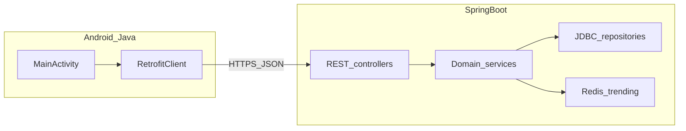
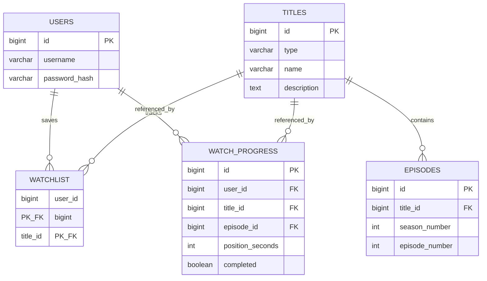

# Kefawatch — Mimari (TBL324)

Kefawatch; katalog, izleme listesi ve izleme ilerlemesi sunan bir **Spring Boot 3 (Java 17)** REST API ve **Native Android (Java)** istemciden oluşur. Kalıcı veri **PostgreSQL + JDBC** ile, popülerlik / trend verisi **Redis (sorted set)** ile tutulur.

## Bileşenler

## Veri modeli (özet ER)

## API yüzeyi (özet)

| Metot | Yol | Açıklama |
|-------|-----|----------|
| POST | `/api/v1/auth/register` | Kullanıcı + JWT |
| POST | `/api/v1/auth/login` | JWT |
| GET | `/api/v1/titles` | Sayfalı katalog |
| GET | `/api/v1/titles/{id}` | Detay + bölümler |
| POST | `/api/v1/titles/{id}/views` | Trend sayacı (Redis) |
| GET | `/api/v1/catalog/trending` | Trend sıralaması |
| GET/POST/DELETE | `/api/v1/watchlist` | Kimlik doğrulamalı |
| GET/PUT | `/api/v1/progress` | İzleme ilerlemesi |

## Tasarım notları

- **Generic:** `ApiResponse<T>`, `PageResult<T>` ortak JSON zarfı ve sayfalama.
- **SOLID:** Controller → servis → port arayüzleri (`TitleRepository`, `TrendingTitleStore`, …); `TitleMetadataSource` strateji soyutlaması.
- **Hata yönetimi:** `@ControllerAdvice` ile `ApiResponse` ve uygun **HTTP 4xx/5xx** kodları.
- **Swagger / OpenAPI:** `springdoc-openapi` — `/api/swagger-ui.html` ve `/api/v3/api-docs`.
